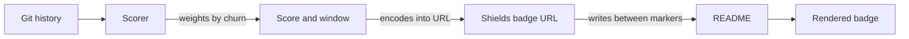

<div align="center">


# rai-commit-badge

**Your git history already knows how much AI wrote. This reads it back.**

_A GitHub Action that scores [RAI attribution footers](https://github.com/anchildress1/rai-lint) and publishes a shields.io badge._

### 📊 Project Stats

[](https://github.com/anchildress1/rai-commit-badge/issues) [](https://github.com/anchildress1/rai-commit-badge/releases) [](LICENSE)

[](https://sonarcloud.io/summary/new_code?id=anchildress1_rai-commit-badge) [](https://sonarcloud.io/summary/new_code?id=anchildress1_rai-commit-badge) [](https://sonarcloud.io/summary/new_code?id=anchildress1_rai-commit-badge) [](https://sonarcloud.io/summary/new_code?id=anchildress1_rai-commit-badge)

[](https://github.com/anchildress1/rai-commit-badge/actions/workflows/ci.yml) [](https://github.com/anchildress1/rai-commit-badge/actions/workflows/check-dist.yml)

### 📦 Marketplace

[](https://github.com/marketplace/actions/rai-commit-attribution-badge)

<!-- prettier-ignore-start -->
<!--START_SECTION:rai-badge-->

<!--END_SECTION:rai-badge-->
<!-- prettier-ignore-end -->

_That badge is this action, scoring itself._

### 🗣️ Languages

[](https://developer.mozilla.org/en-US/docs/Web/JavaScript) [](https://nodejs.org/)

### 🤖 AI & Automation

[](https://claude.com/claude-code) 

### 🔧 Quality & Standards

[](https://conventionalcommits.org/) [](https://commitlint.js.org/) [](https://eslint.org/) 

[](https://vitest.dev/) [](https://prettier.io/) 

---

[Getting Started](#getting-started-) • [Configuration](#configuration-) • [About](#about-) • [Score](#how-the-score-works-) • [Related](#related-)

</div>

---

## Getting Started 🚀

> [!NOTE]
> This action scores RAI footers — it has nothing to read until [rai-lint](https://github.com/anchildress1/rai-lint) is enforcing them on your commits.

**1.** Mark where the badge belongs in your `README.md`:

```markdown
<!--START_SECTION:rai-badge-->
<!--END_SECTION:rai-badge-->
```

> [!TIP]
> If prettier formats your README, wrap the pair in `<!-- prettier-ignore-start -->` and `<!-- prettier-ignore-end -->`. Prettier adds a blank line after the start marker, which the action then rewrites on the next run — the fences keep the block byte-stable.

**2.** Add the workflow:

```yaml
name: RAI Attribution

on:
  push:
    branches: [main]

concurrency:
  group: ${{ github.workflow }}-${{ github.ref }}

jobs:
  score:
    runs-on: ubuntu-latest
    timeout-minutes: 5
    permissions:
      contents: write
      pull-requests: write
    steps:
      - uses: actions/checkout@v7
        with:
          fetch-depth: 0

      - uses: anchildress1/rai-commit-badge@v1
```

> [!IMPORTANT]
> `fetch-depth: 0` is required. A shallow clone has no history to score, and the action fails rather than publishing a wrong number.

> [!IMPORTANT]
> Turn on **Settings → Actions → General → Workflow permissions → "Allow GitHub Actions to create and approve pull requests"**, or the action cannot open its pull request.

> [!IMPORTANT]
> The action syncs the checkout with `origin` before scoring, and refuses to run if the workspace has uncommitted changes or local commits `origin` doesn't have yet — commit or push those in an earlier step, not after this one.

The badge arrives as a pull request on `rai-badge--branches--<base>`, rebuilt from the base each run, so it always holds one commit.

---

## Configuration ⚙️

### Inputs

| Input    | Default               | Description                                                                                                                     |
| -------- | --------------------- | ------------------------------------------------------------------------------------------------------------------------------- |
| `since`  | auto                  | Window start as `YYYY-MM-DD`. Auto-detects your earliest RAI footer. Set it when a stray old footer opens the window too early. |
| `readme` | `README.md`           | Path to the file holding the markers.                                                                                           |
| `style`  | `flat`                | Valid shields style: `flat`, `flat-square`, `plastic`, `for-the-badge`, `social`.                                               |
| `token`  | `${{ github.token }}` | Token used to open the badge pull request. See [Which token](#which-token).                                                     |

### Which token

The default `GITHUB_TOKEN` covers most repos: grant `contents: write` and `pull-requests: write` at the job level and pass nothing.

This input authorises the pull-request API call only — `actions/checkout` supplies the credential that pushes the branch.

Use a PAT or GitHub App token when either applies:

- **You want checks to start on their own.** A pull request opened with `GITHUB_TOKEN` [creates its workflow runs in an approval-required state](https://docs.github.com/en/actions/how-tos/write-workflows/choose-when-workflows-run/trigger-a-workflow#triggering-a-workflow-from-a-workflow): the PR shows a banner, and anyone with write access clicks **Approve workflows to run**. A PAT skips that click.
- **An organisation that disables Actions from creating pull requests.** That setting overrides every repo, and `GITHUB_TOKEN` gets a 403.

The input needs only **Pull requests: Read and write**. Pass the same token to `actions/checkout` so pushes carry it too, and it needs **Contents: Read and write** as well:

```yaml
- uses: actions/checkout@v7
  with:
    fetch-depth: 0
    token: ${{ secrets.RAI_BADGE_TOKEN }}

- uses: anchildress1/rai-commit-badge@v1
  with:
    token: ${{ secrets.RAI_BADGE_TOKEN }}
```

### Output

The badge markdown, written between your markers:

```markdown
<!--START_SECTION:rai-badge-->

<!--END_SECTION:rai-badge-->
```

Granularity and commit counts go to the workflow job summary.

---

## About 🤖

[RAI Lint](https://github.com/anchildress1/rai-lint) enforces AI attribution footers on every commit. Those footers encode an ordinal scale — from `Authored-by` (zero AI) to `Generated-by` (majority AI) — and then sit in your history doing nothing.

`rai-commit-badge` walks that history, weights each commit by how many lines it actually changed, and publishes the result as a badge.

**rai-lint gates, this measures.**

---

## How the score works 🧮

Each footer carries a weight derived from what it declares:

| Footer                | Declares             | Weight |
| --------------------- | -------------------- | ------ |
| `Authored-by`         | Zero AI              | 0.00   |
| `Commit-generated-by` | Trivial AI           | 0.05   |
| `Assisted-by`         | AI helped, human led | 0.25   |
| `Co-authored-by`      | Roughly 50/50        | 0.50   |
| `Generated-by`        | Majority AI          | 0.90   |

Commits are weighted by lines changed. Lockfiles, dependency trees, build output, and minified assets are excluded — so is any commit authored by a known bot (release-please, this action's own committer), since automation has no attribution to declare.

The ceiling is 0.90.

### Scoring starts when you adopted

The window opens at your **earliest RAI footer**, and the badge says so:

```
AI attribution | 42% since 2026-03
```

Inside the window, commits with no footer count as human, at weight 0.

The colour tracks which footer dominates:

| Score   |           |           |
| ------- | --------- | --------- |
| 0–33%   | `#0875AE` | human-led |
| 34–66%  | `#7C3AED` | shared    |
| 67–100% | `#C03070` | AI-led    |

> [!NOTE]
> `Co-authored-by` counts as AI only when the identity matches a known AI tool. Human co-authors score 0 — including the ones GitHub injects automatically when squashing.

---

## What squashing costs 🗜️

Squash merging collapses a PR into one commit: several footers, one line count. With no way to split the churn, the scorer averages the footer weights instead.

| Merge strategy | Attribution                      |
| -------------- | -------------------------------- |
| Merge commit   | Per-commit, exact                |
| Rebase         | Per-commit, exact                |
| Squash         | Averaged across the PR's footers |

The average is size-blind — a one-line config tweak and a full feature count the same. Squashed commits are flagged in the job summary, so the share of your score that was averaged is always visible.

---

## Architecture 🏗️



A new score produces a new URL, so the image refreshes on its own.

---

## Security 🔒

- Runs on the default `GITHUB_TOKEN` and talks to no third-party service. See [Which token](#which-token).
- Needs `contents: write` to push the badge branch and `pull-requests: write` to open the PR. Grant both at the job level.
- Writes only to `rai-badge--branches--<base>`, so your base branch keeps its required checks.
- Reads git history and writes one thing: the marked block in the file you point `readme` at.

---

## What's Next 🔭

- Smarter handling of unattributed commits beyond bots — scope still undefined

See [`docs/prd.md`](docs/prd.md) for full scope.

---

## Related 🔗

| Project                                                  | What it does                                                                                                                                                   |
| -------------------------------------------------------- | -------------------------------------------------------------------------------------------------------------------------------------------------------------- |
| **[rai-lint](https://github.com/anchildress1/rai-lint)** | Enforces the footers at commit time. `commitlint-plugin-rai` for Node, `gitlint-rai` for Python. **Start here** — this action has nothing to score without it. |
| **rai-commit-badge** (you are here)                      | Reads the footers back out of history and publishes the badge.                                                                                                 |

Background on the convention: [Did AI Erase Attribution? Your Git History Is Missing a Co-Author](https://dev.to/anchildress1/did-ai-erase-attribution-your-git-history-is-missing-a-co-author-1m2l)

---

## License 📄

[PolyForm Shield License 1.0.0](./LICENSE) — **not** an OSI open-source licence, so read this bit before you assume MIT-shaped permissions.

Use it, fork it, run it in your company's CI, ship it inside a product you sell. All fine. The one thing Shield forbids is turning this into a competing product — a resale, a rebrand, a hosted version, paid or free. Want to do that? Let's talk first: [anchildress1@gmail.com](mailto:anchildress1@gmail.com).

If you redistribute it, keep the licence and any `Required Notice:` lines intact. That's the whole attribution ask.

---

## Author ✍️

**Ashley Childress**

[](https://dev.to/anchildress1) [](https://www.linkedin.com/in/anchildress1/) [](https://x.com/anchildress1) [](https://www.buymeacoffee.com/anchildress1)

---

<div align="center">

_Stop guessing. Start tracking._

</div>
