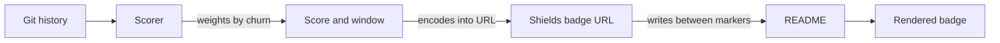

<div align="center">


# rai-commit-badge

**Your git history already knows how much AI wrote. This reads it back.**

_A GitHub Action that scores [RAI attribution footers](https://github.com/anchildress1/rai-lint) and publishes a shields.io badge._

### 📦 Status

[](LICENSE) [](docs/prd.md)

<!--
Add once the infrastructure exists — each of these 404s until then:
[](https://github.com/anchildress1/rai-commit-badge/actions/workflows/ci.yml)
[](https://github.com/anchildress1/rai-commit-badge/actions/workflows/check-dist.yml)
[](https://github.com/anchildress1/rai-commit-badge/releases)
[](https://github.com/marketplace/actions/rai-commit-attribution-badge)
-->

---

[About](#about-) • [Score](#how-the-score-works-) • [Getting Started](#getting-started-) • [Configuration](#configuration-) • [Related](#related-)

</div>

---

## About 🤖

[RAI Lint](https://github.com/anchildress1/rai-lint) enforces AI attribution footers on every commit. Those footers encode an ordinal scale — from `Authored-by` (zero AI) to `Generated-by` (majority AI) — and then sit in your history doing nothing.

`rai-commit-badge` walks that history, weights each commit by how many lines it actually changed, and publishes the result as a badge.

**rai-lint gates, this measures.**

---

## ⚠️ Do not use squash merge

> [!WARNING]
> **Squash merging destroys attribution granularity. For accurate numbers, use merge commits or rebase.**

Squashing collapses every commit in the PR into one message with one line count, so the scorer can no longer tell which lines came from which footer. It averages instead.

| Merge strategy | Attribution | Recommended |
|---|---|---|
| Merge commit | Fully preserved, per-commit | ✅ |
| Rebase | Fully preserved, per-commit | ✅ |
| Squash | Collapsed — scorer must average | ❌ |

Squashed history is flagged in the workflow job summary, so you can see how much of your score was guesswork.

---

## How the score works 🧮

Each footer carries a weight derived from what it declares:

| Footer | Declares | Weight |
|---|---|---|
| `Authored-by` | Zero AI | 0.00 |
| `Commit-generated-by` | Trivial AI, no code | 0.05 |
| `Assisted-by` | AI helped, human led | 0.25 |
| `Co-authored-by` | Roughly 50/50 | 0.50 |
| `Generated-by` | Majority AI | 0.90 |

Commits are weighted by lines changed. Lockfiles, dependency trees, build output, and minified assets are excluded.

The ceiling is 0.90.

### Scoring starts when you adopted

The window opens at your **earliest RAI footer**, and the badge says so:

```
AI attribution | 42% since 2026-03
```

Inside the window, commits with no footer are assumed human and count at weight 0. The job summary reports coverage, so you can see how much of the score is *declared* versus *assumed*.

The colour tracks which footer dominates:

| Score | | |
|---|---|---|
| 0–33% | `#0875AE` | human-led |
| 34–66% | `#7C3AED` | shared |
| 67–100% | `#C03070` | AI-led |

> [!NOTE]
> `Co-authored-by` counts as AI only when the identity matches a known AI tool. Human co-authors score 0 — including the ones GitHub injects automatically when squashing.

---

## Architecture 🏗️



A new score produces a new URL, so the image refreshes on its own.

---

## Getting Started 🚀

**1.** Mark where the badge belongs in your `README.md`:

```markdown
<!--START_SECTION:rai-badge-->
<!--END_SECTION:rai-badge-->
```

**2.** Add the workflow:

```yaml
name: RAI Attribution

on:
  push:
    branches: [main]

concurrency:
  group: ${{ github.workflow }}-${{ github.ref }}

jobs:
  score:
    runs-on: ubuntu-latest
    timeout-minutes: 5
    permissions:
      contents: write
    steps:
      - uses: actions/checkout@v6
        with:
          fetch-depth: 0

      - uses: anchildress1/rai-commit-badge@v1
```

> [!IMPORTANT]
> `fetch-depth: 0` is required. A shallow clone has no history to score, and the action fails rather than publishing a wrong number.

---

## Configuration ⚙️

### Inputs

| Input | Default | Description |
|---|---|---|
| `since` | auto | Window start as `YYYY-MM-DD`. Auto-detects your earliest RAI footer. Set it when a stray old footer opens the window too early. |
| `readme` | `README.md` | Path to the file holding the markers. |
| `style` | `flat` | Valid shields style: `flat`, `flat-square`, `plastic`, `for-the-badge`, `social`. |

### Output

The badge markdown, written between your markers:

```markdown
<!--START_SECTION:rai-badge-->

<!--END_SECTION:rai-badge-->
```

Coverage, granularity, and commit counts go to the workflow job summary.

---

## Security 🔒

- Runs entirely on `GITHUB_TOKEN`. No secrets, no PAT, no third-party service.
- Needs `contents: write` to commit the updated badge line. Grant it at the job level.
- Reads git history and writes one thing: the marked block in the file you point `readme` at.
- Its commits carry RAI footers, so your own commitlint rules stay satisfied.

---

## What's Next 🔭

- **Phase 1** — scoring, badge, Marketplace listing
- **Phase 2** — smarter handling of unattributed commits, starting with bot-authored ones

See [`docs/prd.md`](docs/prd.md) for full scope.

---

## Related 🔗

| Project | What it does |
|---|---|
| **[rai-lint](https://github.com/anchildress1/rai-lint)** | Enforces the footers at commit time. `commitlint-plugin-rai` for Node, `gitlint-rai` for Python. **Start here** — this action has nothing to score without it. |
| **rai-commit-badge** (you are here) | Reads the footers back out of history and publishes the badge. |

Background on the convention: [Did AI Erase Attribution? Your Git History Is Missing a Co-Author](https://dev.to/anchildress1/did-ai-erase-attribution-your-git-history-is-missing-a-co-author-1m2l)

---

## License 📄

[PolyForm Shield License 1.0.0](./LICENSE) — **not** an OSI open-source licence, so read this bit before you assume MIT-shaped permissions.

Use it, fork it, run it in your company's CI, ship it inside a product you sell. All fine. The one thing Shield forbids is turning this into a competing product — a resale, a rebrand, a hosted version, paid or free. Want to do that? Let's talk first: [anchildress1@gmail.com](mailto:anchildress1@gmail.com).

If you redistribute it, keep the licence and any `Required Notice:` lines intact. That's the whole attribution ask.

---

## Author ✍️

**Ashley Childress**

[](https://dev.to/anchildress1) [](https://www.linkedin.com/in/anchildress1/) [](https://x.com/anchildress1) [](https://www.buymeacoffee.com/anchildress1)

---

<div align="center">

_Stop guessing. Start tracking._

</div>
